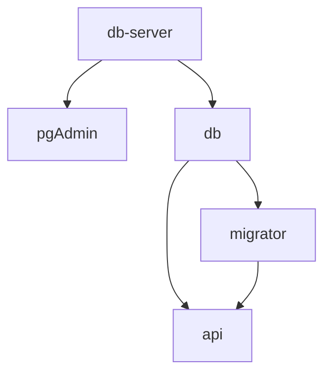

# Todo app using Nall.Aspire.Hosting.DependsOn

Startup dependencies:



## Run

```bash
dotnet run --project AppHost
```

### Migrations

```bash
dotnet ef migrations add "Initial_Migration" \
    --startup-project ./MigrationService \
    --project ./Data
```
